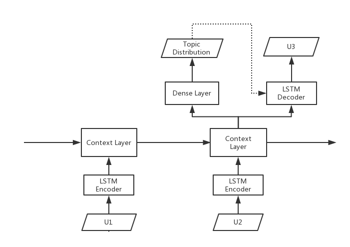

# topic-reinforcement-net

##hierarchical encode framwork + topic net + policy net

The idea behind this model is inspired by LDA, suppose every utterance is generated by a topic, and the words distribution of this topic.But it is different from LDA, because it is not a bag of words model(cause of the RNN).

